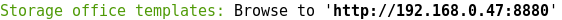

# server-welcome

> Give a message to display when server start with the port, the name and the address.

[](https://travis-ci.org/cedced19/server-welcome)
[](http://badge.fury.io/js/server-welcome)

## Install

```
npm install --save server-welcome
```

## Usage

```js
require('server-welcome')('8080', 'Server name');
//=> 'Server name: Browse to 'http://192.168.0.47:8080''
```
## Demo



## License

MIT @ [Cédric JUNG](https://cedced19.github.io/)
